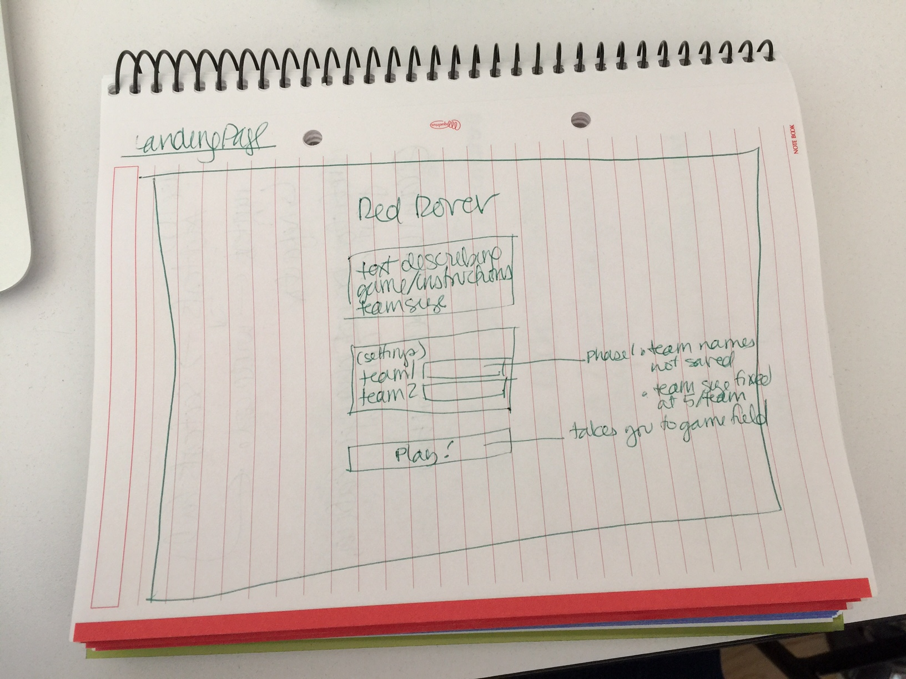
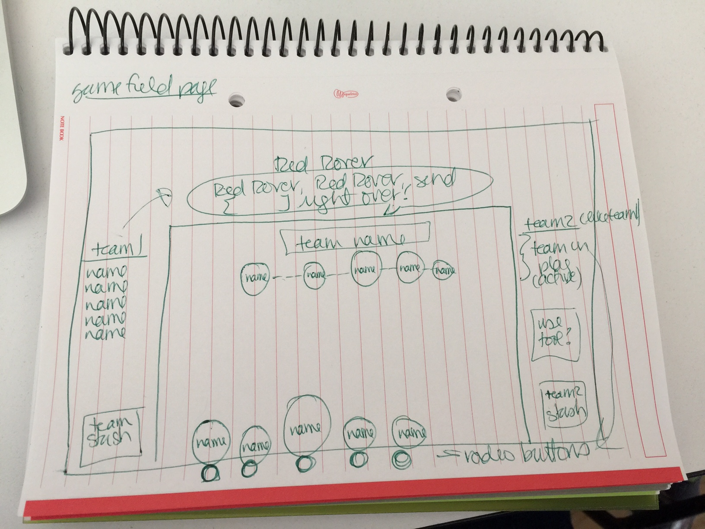

# project-1
Project 1: a browser game

### overview

Remember those games we played as children? Dodge ball? Tag? Hide and seek? This is a bitter/cynical recreation of my childhood nightmare: Red Rover.

This is a two-player game, with each player (or captain) leading a team of mammals (1st graders? thugs (a/k/a the neighborhood kids)? zombies? raccoons? actual mammals are still TBD and will depend on both time and my image-Googling skills). Team-size is determined by the players before the game starts. 

Using animation and DOM manipulation to show the results, each team will alternate "Red Rover, Red Rover, send [insert your least liked mammal on the other team] right over" requests, until all mammals are on the same team (unless they're no longer breathing, of course).

Possible upgrades to the game:
* ability to select which of the 2 players to add to your team when you break through
* scoreboard showing top 5 teams
* time-limit the game (you know, like the way recess limited the time we had to play this evil game)
* varying health/strength/likeability scores for each of the team members that are updated after
each round
* random tools allocated to each team at the start of a new game (e.g., grenades, killer bees, stink bombs, power juice)
* ability to pick team members from a pool of mammals

Here's a [description, and some history, of Red Rover](https://en.wikipedia.org/wiki/Red_Rover), if you've successfully blocked this particular humiliation from your memory.

---

### technologies used
* HTML
* CSS
* JavaScript
* DOM manipulation _(vanilla JS or jQuery???)_
* _Canvas?_
* _Flexbox?_

---

### approach taken

7/11/17: Set up [Trello account] (https://trello.com/conniekephart) to track stories/progress; project board is [Red Rover] (https://trello.com/b/zXJaTWNl/red-rover).

7/10/17: Started design with some rough wireframes of the landing page and game board.

---

### installation instructions

---

### unsolved problems

Overall project status is tracked in [Trello] (https://trello.com/b/zXJaTWNl/red-rover).

---

### etc.
